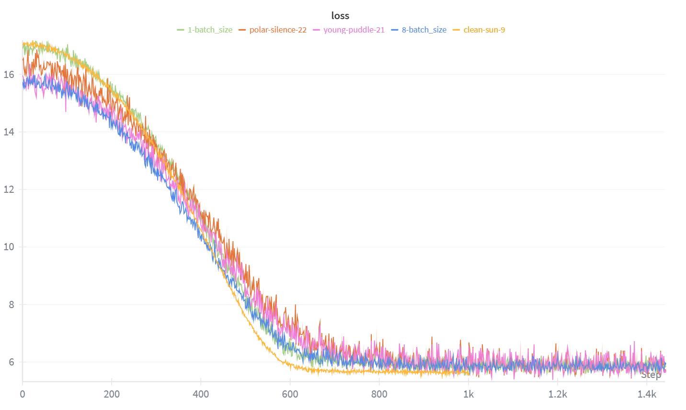

# CS336 Spring 2025 Assignment 1: 从零实现Transformer语言模型

本项目是斯坦福大学CS336课程《Language Modeling from Scratch》的第一份Lab——**Basics**的完整实现。通过本次作业，我从零开始构建了训练标准Transformer语言模型所需的所有核心组件，并在TinyStories数据集上完成了简单的模型训练与评估。

## 项目概述

在本次项目中，我独立实现了以下核心模块，具体实现全部在cs336-basics文件夹内：

### 1. **字节对编码（BPE）分词器**
- 实现字节级BPE分词算法，将任意Unicode字符串转换为字节序列
- 在TinyStories数据集上训练分词器词汇表
- 提供文本与token ID之间的完整编解码功能

### 2. **Transformer语言模型** 
- 实现完整的仅解码器（Decoder-only）Transformer架构
- 包含多头因果自注意力机制（Multi-Head Causal Self-Attention）
- 集成旋转位置编码（RoPE）、RMSNorm归一化、SwiGLU激活函数等现代设计
- 支持残差连接和Dropout正则化

### 3. **优化与损失函数** 
- 从零实现AdamW优化器（支持权重衰减和解耦学习率）
- 实现带权重衰减和梯度裁剪的自定义余弦学习率调度器
- 实现交叉熵损失函数（支持标签平滑）

### 4. **训练框架** 
- 构建完整的训练循环，支持模型与优化器状态的序列化/加载
- 支持从训练模型生成文本样本
- 集成wandb实现训练过程可视化

### 5. **数据管道** 
处理TinyStories和OpenWebText数据集
- 构建随机采样和批处理的数据加载器
- 实现高效的文本tokenization和序列打包

## 实验结果

限制于本人算力原因，只在TinyStories数据集的部分数据上简单地进行了模型训练，并简单记录了训练loss，每条曲线采用了不同的训练参数，约训练五分钟，后续若有机会，将完成更多的训练实验：

## 技术亮点

- **纯从零实现**：除PyTorch基础张量操作外，未使用`torch.nn`, `torch.nn.functional`, `torch.optim`中的任何预置模块
- **现代架构设计**：集成RoPE、RMSNorm、SwiGLU等前沿技术
- **工程实践**：模块化设计、完整测试覆盖、支持断点续训

## 致谢

**特别感谢斯坦福大学CS336课程团队**：

本项目的作业框架、测试设计、数据集准备以及原始代码结构均由[Stanford CS336 (Spring 2025)](https://github.com/stanford-cs336/assignment1-basics)课程团队精心设计和提供。他们创建的这个优秀的教学项目让我能够深入理解大型语言模型的内部机制，掌握从零构建现代Transformer架构的核心技能。

- **原始仓库**: [https://github.com/stanford-cs336/assignment1-basics](https://github.com/stanford-cs336/assignment1-basics)
- **项目说明**: [cs336_spring2025_assignment1_basics.pdf](https://github.com/stanford-cs336/assignment1-basics/blob/main/cs336_spring2025_assignment1_basics.pdf)
- **课程主页**: [https://cs336.stanford.edu/](https://cs336.stanford.edu/)

感谢Prof. Tatsunori Hashimoto以及所有助教和课程贡献者的工作，这门课程让我受益匪浅！

## 许可证

本项目基于[Stanford CS336 Assignment 1](https://github.com/stanford-cs336/assignment1-basics)的原始框架，遵循课程规定的使用条款。原始代码的版权归斯坦福大学所有。
